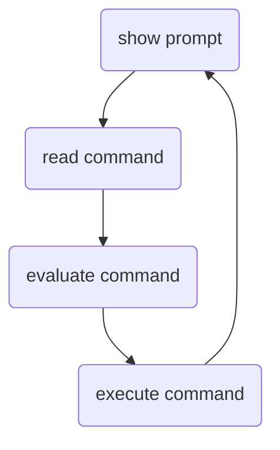

# Minishell | 42 São Paulo

## Table of Contents
* [1 - Introduction](#introduction)
	* [1.1 - What the Shell](#11---what-the-shell)
	* [1.2 - How the Shell Works](#12---how-the-shell-works)
* [2 - Lexical Analysis and Tokenization](#2---lexical-analysis-and-tokenization)
<!-- * [Allowed Functions](#allowed-function) -->

## 1 - Introduction

This project is about recreating your very own (mini)shell, using bash as a reference. This is my first group project at [42 São Paulo](https://www.42sp.org.br/), and my partner in crime is the great [@bbonaldi](https://github.com/brunobonaldi94).

### 1.1 - What the Shell

Following the Oxford English's dictionary, `shell` <i>(/SHel/)</i> is <i>"The hard protective outer case of a mollusk or crustacean"</i>. When you aplly this logic into computer science it makes total sense. In that case computer shells are a protective way to guard your operational system, and allow the user to interact with it trough an interface without direct access to its kernel.
Besides being a communication tool the shell does not need to do much, it's only need to know where to find and how the execute what the user requests, and then send it to the OS.

### 1.2 - How the Shell Works?

The shell is a type of program called <i>interpreter</i>, it operates in a <b>REP loop</b>. First accepts a command (READ), interprets it (EVALUATE), executes it (PRINT), and then awaits for another one by displaying a <b>prompt</b> to notify the user that it is ready to accept a new command. The loop is interrupted only when a command is sended to the programm, e.g `exit()`, `CNTRL+C` and `CNTRL+D`.  

 

<<<<<<< HEAD
## 2 - Lexical Analysis and Tokenization

The first thing shell does to execute a program is to figure out how many commands are in the input received, making use of lexer responsible for doing a <b>Lexical Analysis</b> the shell determines how many <i>tokens</i> there are on the command line. But what is a token? Token is the small unit in a command line. Passing the given the command line into a lexer `cat <<eof >file1 && cat file1 && abc || wc <file1 | cat >file2` the tokens are:

| token[0] | token[1] | token[2] | token[3] | token[4] | token[5] | token[6] | token[7] | token[8] | token[9] | token[10] | token[11] | token[12] | token[13] |
| :---: | :---: | :---: | :---: | :---: | :---: | :---: | :---: | :---: | :---: | :---: | :---: | :---: |
| `cat` | `<<eof` | `>file12` | `&&` | `cat` | `file1` | `&&` | `abc` | `||` | `wc` | `<file1` | `|` | `cat` | `>file2` |
=======

>>>>>>> fba61f9426d3728e5d6d9f9214fba5be4f8971f5

<!-- ### Allowed Functions

| Function | Lib | Prototype | Description |
| --- | --- | --- | --- |
| `readline()` | <stdio.h> <readline/readline.h> <readline/history.h> | `char *readline (const char *prompt);` | This function reads a line from the terminal and returns it, while waiting for input allows the user to edit the line. This is the function to be used in order to show the `prompt` in the program terminal. [man](https://www.man7.org/linux/man-pages/man3/readline.3.html) |
| `rl_clear_history()` | <stdio.h> <readline/readline.h> <readline/history.h> | `void rl_clear_history(void)` | Clears the history deleting all of the entries readed by `readline()`. [man](https://tiswww.case.edu/php/chet/readline/readline.html#index-rl_005fclear_005fhistory) |
| `rl_on_new_line()` | <stdio.h> <readline/readline.h> <readline/history.h> | `int rl_on_new_line(void) | Tell the update functions that we have moved ont a new (empty) line, usually after outputting a newline. [man](https://tiswww.case.edu/php/chet/readline/readline.html#index-rl_005fon_005fnew_005fline) |
| `rl_replace_line()` | <stdio.h> <readline/readline.h> <readline/history.h> | `void rl_replace_line (const char *text, int clear_undo)` | Replace the contents of the `buffer` with it's `text`. [man](https://tiswww.case.edu/php/chet/readline/readline.html#index-rl_005freplace_005fline) |
| `rl_redisplay()` | <stdio.h> <readline/readline.h> <readline/history.h> | `void rl_display(void)` | Change what's displayed on the screen to reflect the current contents of `buffer` [man](https://tiswww.case.edu/php/chet/readline/readline.html#index-rl_005fredisplay) |
| `add_history()` | <history.h> | `void add_history (const char *string)` | Adds a new <i>string</i> at the end of the history list readed by `readline()` [man](https://linux.die.net/man/3/history) |
| `printf()` | <stdio.h> | `int printf(const char *restrict format, ...)` | The function produces an output according to it's format and writes it to <b>stdout</b>. [man](https://www.man7.org/linux/man-pages/man3/printf.3.html) |
| `malloc()` | <stdlib.h> | `void *malloc(size_t size)` | Allocates size bytes and returns a pointer to the allocated memory. [man](https://www.man7.org/linux/man-pages/man3/malloc.3.html) |
| `free()` | <stdlib.h> | `void free(void *ptr)` | Frees the memory allocated by `malloc()`, `calloc()` or `realloc()`. [man](https://www.man7.org/linux/man-pages/man3/malloc.3.html) |
| `write()` | <unistd.h> | `ssize_t write(int fd, const void *buf, size_t count)` | Writes up to count bytes from the buffer starting at buf to referred fd. [man](https://man7.org/linux/man-pages/man2/write.2.html) |
| `access()` | <unistd.h> | `int access(const char *pathname, int mode)` | Use to check if the calling process can access the file in <i>pathname</i>. [man](https://www.man7.org/linux/man-pages/man2/access.2.html) |
| `open()` | <fcntl.h> | `int open(const char *pathname, int flags, mode_t mode)` | Opens a file specified by a pathname. If the file exists, than returns its fd. [man](https://www.man7.org/linux/man-pages/man2/open.2.html) |
| `read()` | <unistd.h> | `ssize_t read(int fd, void *buf, size_t count)` | Reads to count size from a fd. [man](https://man7.org/linux/man-pages/man2/read.2.html). |
| `close()` | <unistd.h> | `int close(int fd)` | As the name implies, it closes a fd. [man](https://www.man7.org/linux/man-pages/man2/close.2.html) |
| `fork()` |
| `wait()` |
| `waitpid()` |
| `wait3()` |
| `wait4()` |
| `signal()` |
| `sigaction()` |
| `sigemptyset()` |
| `sigaddset()` |
| `kill()` |
| `exit()` |
| `getcwd()` |
| `chdir()` |
| `stat()` |
| `lstat()` |
| `fstat()` |
| `unlink()` |
| `execve()` |
| `dup()` |
| `dup2()` |
| `pipe()` |
| `opendir()` |
| `readdir()` |
| `closedir()` |
| `strerror()` |
| `perror()` |
| `isatty()` |
| `ttyname()` |
| `ttyslot()` |
| `ioctl()` |
| `etenv()` |
| `tcsetattr()` |
| `tcgetattr()` |
| `tgetent()` |
| `tgetflag()` |
| `tgetnum()` |
| `tgetstr()` |
| `tgoto()` |
| `tputs()` | -->
